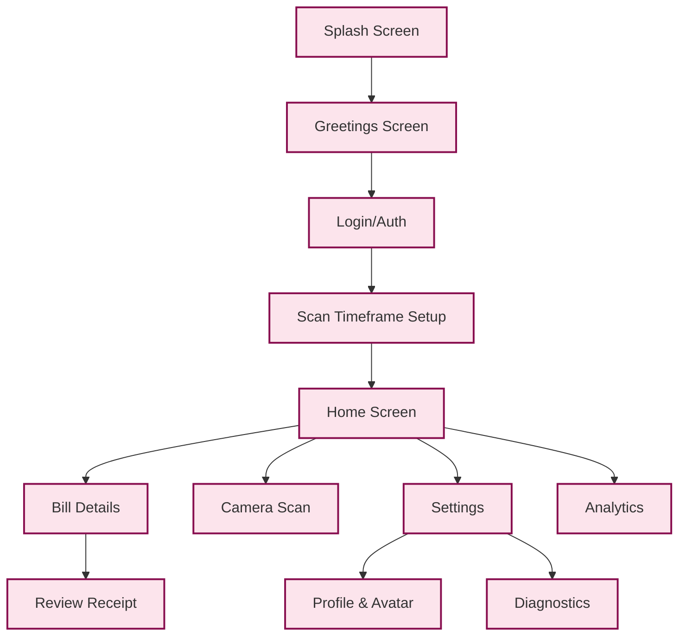

# Platisa Technical Manual & User Guide

> [!NOTE]
> This document serves as both a detailed User Manual and a Technical Architecture Guide for the Platisa Android application.

## 1. System Overview

**Platisa** is a sophisticated personal finance application tailored for the Serbian market, designed to automate the tracking and management of household bills (electricity, water, phone, internet). It leverages advanced technologies like OCR (Optical Character Recognition), Machine Learning, and Cloud Sync to turn physical or digital bills into structured, actionable data.

### Core Architecture
The application follows **Clean Architecture** principles combined with the **MVVM (Model-View-ViewModel)** pattern.

*   **UI Layer (Presentation)**: Built entirely with **Jetpack Compose** (Material 3). It observes state from ViewModels and renders the interface.
*   **Domain Layer (Business Logic)**: Contains Use Cases (`SyncReceiptsUseCase`, `ScanReceiptUseCase`) and pure business logic. This layer is independent of the Android framework.
*   **Data Layer (Persistence & Network)**: Manages data sources including **Room Database** (local SQL storage), **DataStore** (preferences), **Firebase Firestore** (cloud synchronization of paid statuses), and **Gmail API** (fetching bills).

---

## 2. User Manual (Functional Guide)

### 2.1 Onboarding & Identity
*   **Google Sign-In**: The app requires a Google account to function. This provides a secure identity for syncing bills and backing up payment statuses.
*   **Profile Customization**:
    *   **Name**: Users can set a display name.
    *   **Avatar**: Supports three sources:
        1.  **Gallery**: Pick an existing photo.
        2.  **Camera**: Take a specialized "Selfie" within the app.
        3.  **Predefined Assets**: Choose from a library of built-in avatars.
    *   **Splash Screen**: Users can customize the app's startup aesthetic by selecting different background visuals.

### 2.2 Home Screen (Dashboard)
The central hub of the application.
*   **Monthly Overview**: Displays the total accumulated bills for the current month.
*   **Bill List**: Shows a list of scanned bills, categorized by merchant (EPS, Infostan, Telekom, etc.).
*   **Status Indicators**:
    *   🟢 **PAID**: Bill has been marked as paid.
    *   🔴 **UNPAID**: Bill is pending payment.
    *   ⚠️ **OVERDUE**: The due date has passed.

### 2.3 Adding Bills
There are three ways to add bills to Platisa:
1.  **Camera Scan**: Point the camera at a physical paper bill. The app detects the QR code (IPS) or uses OCR to read the text.
2.  **Gallery Import**: Select an image or PDF from the phone's storage.
3.  **Gmail Sync**: The app connects to the user's Gmail (via `GmailSyncWorker`) and searches for attachments from known issuers (e.g., `racun@eps.rs`, `racun@mts.rs`).

### 2.4 Bill Management
*   **Detailed View**: Tapping a bill reveals deep details:
    *   **Amount breakdown** (Current charge vs. Previous debt).
    *   **Consumption data** (for EPS electricity: VT/NT).
    *   **Graphs**: Historical spending trends for that specific merchant.
*   **Mark as Paid**: Users can manually toggle the status. This status is synced to the cloud (Firestore) so it reflects across all devices logged into the same account.
*   **Share**: Export bill data as text or image for archiving or sharing.

### 2.5 Settings & Tools
*   **Themes**: Toggle between Light, Dark, or System theme.
*   **Notifications**: Configure reminders for due dates (3 days before, 1 day before).
*   **Data Management**:
    *   **Export**: Generate CSV or PDF reports of all bills.
    *   **Reset**: Wipe all local data or specifically reset the Gmail sync history.
*   **Diagnostics**: A hidden menu for debugging logs, syncing logic, and app signatures.

---

## 3. Technical Deep Dive (Engineer's Guide)

### 3.1 Data Models & Identity

#### The `Receipt` Entity
The core data structure representing a single bill. Key fields include:
*   `id`: Internal database ID (Auto-increment).
*   `deterministicId`: A unique string generated from the bill's content (`InvoceNumber + Date + Amount`). This ensures that if the same bill is scanned by Camera and later found in Gmail, they resolve to the **SAME** entity.
*   `merchantName`: Normalized name of the bill issuer (e.g., "EPS DISTRIBUCIJA").
*   `totalAmount`: The final amount to pay.
*   `currentMonthAmount`: Smart-parsed amount for *this specific month's* consumption, separating it from old debt.

#### The `EpsData` Entity
A specialized extension for Electric Power Industry of Serbia (EPS) bills.
*   `consumptionVt` / `consumptionNt`: High/Low tariff consumption in kWh.
*   `discountThresholdAmount`: The amount required to reach the 5% discount.
*   `naplatniBroj`: The unique account number for the physical location (meter).

### 3.2 Core Algorithms

#### A. OCR & Parsing (`ReceiptParser.kt`)
The app uses a multi-stage parsing pipeline:
1.  **Text Extraction**: Google ML Kit Vision extracts raw text from images.
2.  **Regex Hierarchies**:
    *   **Standard Pattern**: Looks for `Price Quantity Total` lines.
    *   **QXP Pattern**: Looks for `Quantity x Price Total` lines.
    *   **Header Parsing**: Merchant names are identified via known keywords or strict header analysis.
3.  **Merchant-Specific Logic**:
    *   **Infostan**: Specifically looks for "Identifikacioni broj" and "Opština".
    *   **Telekom/MTS**: Parses specific 3-line address formats.
4.  **Serbian Language Support**: Handles both Cyrillic (`Рачун`) and Latin (`Račun`) scripts transparently using normalization maps.

#### B. Gmail Sync (`SyncReceiptsUseCase.kt`)
*   **OAuth Integration**: Uses Google Sign-In with scopes for reading read-only email access.
*   **Attachment Filtering**:
    *   Downloads PDF attachments.
    *   **Bank Statement Filter**: Aggressively blocks files containing keywords like "Izvod", "Stanje na dan" to prevent bank statements from being parsed as bills.
*   **PDF Processing**:
    *   Tries to extract strict raw text from PDF.
    *   If that fails (image-only PDF), it renders pages to bitmaps and runs OCR.
    *   **IPS QR Extraction**: Uses native PDF analysis to find the IPS QR code payload directly.

#### C. Deduplication Engine (`BillDuplicateDetector.kt`)
Prevents the same bill from cluttering the list.
*   **Highlander Rule**: "There can be only one." For bills with the same `NaplatniBroj` (Account ID) and `BillingPeriod`, only one is visible.
*   **Scoring System**: When duplicates are found, they are ranked:
    1.  **PAID** status (+100 pts) - A paid bill is always better.
    2.  **Correction Key** (+50 pts) - A bill marked "IS_CORRECTION" supersedes originals.
    3.  **QR Code** (+30 pts) - Scans with QR are more reliable than text-only OCR.
    4.  **Invoice Number Length** (+10 pts) - Longer/complete numbers are preferred.
*   **Storno Logic**: If a "Storno" (cancellation) bill is found, it automatically "hides" the corresponding original bill AND itself, effectively removing the erroneous charge from the UI.

#### D. Anomaly Detection (`BillAnomalyDetector`)
Protecting the user from errors.
*   **Sudden Drop**: If a bill is >50% lower than the 3-month average, it's flagged as a potential parsing error (or partial scan).
*   **Spike Alert**: If a bill is >200% higher than average, the user is warned (potential leak or seasonal spike).

### 3.3 Build & Deployment

*   **Build System**: Gradle with Kotlin DSL (`build.gradle.kts`).
*   **Dependency Injection**: Hilt/Dagger for managing components.
    *   `@HiltViewModel` for ViewModels.
    *   `@AndroidEntryPoint` for Activities/Fragments.
*   **Key Debug Command**:
    ```bash
    ./gradlew assembleDebug
    ```
    This compiles the app and generates the APK for testing.
*   **App Signature**: The app logs its signing certificate hash on startup (visible in `DiagnosticsHelper`) to facilitate Firebase/Google API configuration.

---

## 4. Visual Architecture

### 4.1 Data Flow Diagram

```mermaid
graph TD
    classDef source fill:#e1f5fe,stroke:#01579b,stroke-width:2px;
    classDef process fill:#fff3e0,stroke:#e65100,stroke-width:2px;
    classDef store fill:#e8f5e9,stroke:#1b5e20,stroke-width:2px;
    classDef ui fill:#f3e5f5,stroke:#4a148c,stroke-width:2px;

    User((User)):::source
    Gmail((Gmail API)):::source
    
    User -->|Take Photo| Camera[Camera - Review Screen]:::process
    Gmail -->|Fetch| Worker[GmailSyncWorker]:::process
    
    subgraph Processing Pipeline
        Camera --> OCR[ML Kit Text Recognition]:::process
        Worker --> Filter[Bank Statement Filter]
        Filter --> PDF[PDF Parser/Renderer]
        PDF --> OCR
        
        OCR --> Parser[ReceiptParser (Regex)]:::process
        Parser --> Normalizer[Serbian Text Normalizer]
        Normalizer --> Dedup[BillDuplicateDetector]:::process
    end
    
    Dedup -->|Calculate Score| DB[(Room Database)]:::store
    
    subgraph Storage & Sync
        DB <-->|Read/Write| Repo[ReceiptRepository]:::store
        Repo <-->|Sync Paid Status| Fire[(Firestore)]:::store
    end
    
    Repo --> ANOM[Anomaly Detector]:::process
    ANOM --> ViewModel[MainViewModel / HomeViewModel]:::ui
    ViewModel --> UI[Jetpack Compose UI]:::ui
```

### 4.2 Navigation Graph


