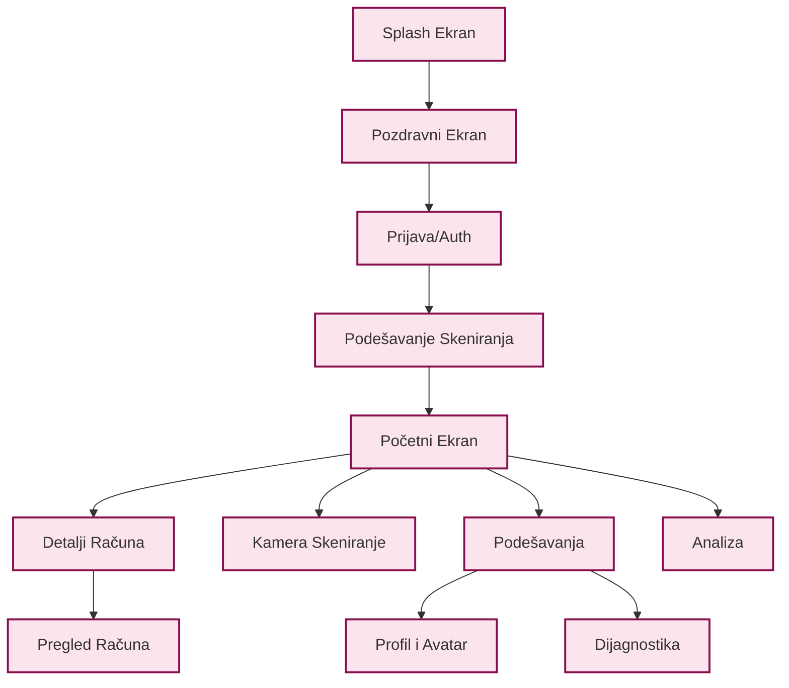

# Platiša - Tehničko Uputstvo i Korisnički Vodič

> [!NOTE]
> Ovaj dokument služi kao detaljno korisničko uputstvo i tehnički vodič za Android aplikaciju Platiša. Može se odštampati u PDF formatu.

## 1. Pregled Sistema

**Platiša** je sofisticirana aplikacija za lične finansije, prilagođena tržištu Srbije, dizajnirana da automatizuje praćenje i upravljanje kućnim računima (struja, voda, telefon, internet). Koristi napredne tehnologije kao što su OCR (Optičko prepoznavanje znakova), mašinsko učenje i Cloud sinhronizacija kako bi fizičke ili digitalne račune pretvorila u strukturirane i korisne podatke.

### Osnovna Arhitektura
Aplikacija prati principe **Clean Architecture** u kombinaciji sa **MVVM (Model-View-ViewModel)** obrascem.

*   **UI Sloj (Prezentacija)**: Izgrađen u potpunosti koristeći **Jetpack Compose** (Material 3). Posmatra stanje iz ViewModel-a i iscrtava interfejs.
*   **Domain Sloj (Poslovna Logika)**: Sadrži Use Cases (`SyncReceiptsUseCase`, `ScanReceiptUseCase`) i čistu poslovnu logiku. Ovaj sloj je nezavisan od Android framework-a.
*   **Data Sloj (Perzistencija i Mreža)**: Upravlja izvorima podataka uključujući **Room Bazu** (lokalno SQL skladište), **DataStore** (podešavanja), **Firebase Firestore** (cloud sinhronizacija statusa plaćanja) i **Gmail API** (preuzimanje računa).

---

## 2. Korisničko Uputstvo (Funkcionalni Vodič)

### 2.1 Prvi Koraci i Identitet
*   **Google Prijava**: Aplikacija zahteva Google nalog za funkcionisanje. Ovo obezbeđuje siguran identitet za sinhronizaciju računa i "backup" statusa plaćanja.
*   **Prilagođavanje Profila**:
    *   **Ime**: Korisnici mogu postaviti ime za prikaz.
    *   **Avatar**: Podržava tri izvora:
        1.  **Galerija**: Odabir postojeće fotografije.
        2.  **Kamera**: Snimanje specijalizovanog "Selfija" unutar aplikacije.
        3.  **Predefinisani Avatari**: Odabir iz biblioteke ugrađenih avatara.
    *   **Početni Ekran**: Korisnici mogu prilagoditi estetiku pokretanja aplikacije odabirom različitih pozadinskih vizuala (Splash Screen).

### 2.2 Početni Ekran (Dashboard)
Centralni deo aplikacije.
*   **Mesečni Pregled**: Prikazuje ukupne akumulirane račune za tekući mesec.
*   **Lista Računa**: Prikazuje listu skeniranih računa, kategorisanih po trgovcu (EPS, Infostan, Telekom, itd.).
*   **Indikatori Statusa**:
    *   🟢 **PLAĆENO**: Račun je označen kao plaćen.
    *   🔴 **NIJE PLAĆENO**: Račun čeka na plaćanje.
    *   ⚠️ **ISTEKLO**: Rok za plaćanje je prošao.

### 2.3 Dodavanje Računa
Postoje tri načina za dodavanje računa u Platišu:
1.  **Skeniranje Kamerom**: Usmerite kameru ka fizičkom papirnom računu. Aplikacija detektuje IPS QR kod ili koristi OCR za čitanje teksta.
2.  **Uvoz iz Galerije**: Odaberite sliku ili PDF iz memorije telefona.
3.  **Gmail Sinhronizacija**: Aplikacija se povezuje sa vašim Gmail nalogom (putem `GmailSyncWorker`) i traži priloge od poznatih izdavalaca (npr. `racun@eps.rs`, `racun@mts.rs`).

### 2.4 Upravljanje Računima
*   **Detaljan Prikaz**: Dodirom na račun otvaraju se detalji:
    *   **Raščlanjivanje iznosa** (Tekuće zaduženje vs. Prethodni dug).
    *   **Podaci o potrošnji** (za EPS struju: VT/NT).
    *   **Grafikoni**: Istorijat troškova za tog konkretnog trgovca.
*   **Označi kao Plaćeno**: Korisnici mogu ručno promeniti status. Ovaj status se sinhronizuje sa oblakom (Firestore) tako da se reflektuje na svim uređajima prijavljenim na isti nalog.
*   **Deli**: Izvoz podataka o računu kao tekst ili slika za arhiviranje ili deljenje.

### 2.5 Podešavanja i Alati
*   **Teme**: Prebacivanje između Svetle, Tamne ili Sistemske teme.
*   **Obaveštenja**: Konfigurisanje podsetnika za datume dospeća (3 dana pre, 1 dan pre).
*   **Upravljanje Podacima**:
    *   **Izvoz**: Generisanje CSV ili PDF izveštaja svih računa.
    *   **Resetovanje**: Brisanje svih lokalnih podataka ili specifično resetovanje istorije Gmail sinhronizacije.
*   **Dijagnostika**: Skriveni meni za logove otklanjanja grešaka, logiku sinhronizacije i potpise aplikacije.

---

## 3. Tehnički Pregled (Vodič za Inženjere)

### 3.1 Modeli Podataka i Identitet

#### Entitet `Receipt` (Račun)
Osnovna struktura podataka koja predstavlja jedan račun. Ključna polja uključuju:
*   `id`: Interni ID baze podataka (Auto-increment).
*   `deterministicId`: Jedinstveni string generisan iz sadržaja računa (`BrojRacuna + Datum + Iznos`). Ovo osigurava da ako se isti račun skenira kamerom i kasnije pronađe na Gmail-u, oni se rešavaju kao **ISTI** entitet.
*   `merchantName`: Normalizovano ime izdavaoca računa (npr. "EPS DISTRIBUCIJA").
*   `totalAmount`: Konačan iznos za uplatu.
*   `currentMonthAmount`: Pametno parsiran iznos za *potrošnju u ovom mesecu*, odvojen od starog duga.

#### Entitet `EpsData`
Specijalizovano proširenje za račune EPS-a (Elektroprivreda Srbije).
*   `consumptionVt` / `consumptionNt`: Potrošnja u višoj/nižoj tarifi (kWh).
*   `discountThresholdAmount`: Iznos potreban za ostvarivanje popusta od 5%.
*   `naplatniBroj`: Jedinstveni broj brojila/mernog mesta.

### 3.2 Osnovni Algoritmi

#### A. OCR i Parsiranje (`ReceiptParser.kt`)
Aplikacija koristi višestepeni proces parsiranja:
1.  **Ekstrakcija Teksta**: Google ML Kit Vision izvlači sirovi tekst iz slika.
2.  **Regex Hijerarhije**:
    *   **Standardni Obrazac**: Traži linije `Cena Količina Ukupno`.
    *   **QXP Obrazac**: Traži linije `Količina x Cena Ukupno`.
    *   **Parsiranje Zaglavlja**: Imena trgovaca se identifikuju putem poznatih ključnih reči ili stroge analize zaglavlja.
3.  **Logika Specifična za Trgovce**:
    *   **Infostan**: Specifično traži "Identifikacioni broj" i "Opština".
    *   **Telekom/MTS**: Parsira specifične formate adresa u 3 reda.
4.  **Podrška za Srpski Jezik**: Transparentno rukuje i ćirilicom (`Рачун`) i latinicom (`Račun`) koristeći mape normalizacije.

#### B. Gmail Sinhronizacija (`SyncReceiptsUseCase.kt`)
*   **OAuth Integracija**: Koristi Google Sign-In sa dozvolama za čitanje email-ova (read-only).
*   **Filtriranje Priloga**:
    *   Preuzima PDF priloge.
    *   **Filter Izvoda Banke**: Agresivno blokira fajlove koji sadrže ključne reči poput "Izvod", "Stanje na dan" kako bi sprečio da se izvodi iz banke parsiraju kao računi.
*   **Obrada PDF-a**:
    *   Pokušava da izvuče strogi sirovi tekst iz PDF-a.
    *   Ako to ne uspe (PDF koji je samo slika), renderuje stranice u Bitmap-e i pokreće OCR.
    *   **IPS QR Ekstrakcija**: Koristi nativnu analizu PDF-a da pronađe IPS QR kod direktno.

#### C. Mehanizam Deduplikacije (`BillDuplicateDetector.kt`)
Sprečava gomilanje istih računa u listi.
*   **Pravilo "Highlander"**: "Može postojati samo jedan." Za račune sa istim `NaplatniBroj` i `BillingPeriod`, samo jedan je vidljiv.
*   **Sistem Bodovanja**: Kada se pronađu duplikati, oni se rangiraju:
    1.  **PLAĆENO** status (+100 poena) - Plaćen račun je uvek bolji.
    2.  **Korekcija** (+50 poena) - Račun označen kao "IS_CORRECTION" zamenjuje originale.
    3.  **QR Kod** (+30 poena) - Skenovi sa QR kodom su pouzdaniji od čistog OCR-a.
    4.  **Dužina Broja Računa** (+10 poena) - Duži/kompletniji brojevi se preferiraju.
*   **Storno Logika**: Ako se pronađe "Storno" račun, on automatski "sakriva" odgovarajući originalni račun I samog sebe, efektivno uklanjajući pogrešno zaduženje iz UI-a.

#### D. Detekcija Anomalija (`BillAnomalyDetector`)
Zaštita korisnika od grešaka.
*   **Nagli Pad**: Ako je račun >50% manji od tromesečnog proseka, označava se kao potencijalna greška parsiranja (ili delimičan sken).
*   **Upozorenje na Skok**: Ako je račun >200% veći od proseka, korisnik se upozorava (potencijalno curenje vode ili sezonski skok).

### 3.3 Izrada i Isporuka (Build & Deployment)

*   **Sistem Izrade**: Gradle sa Kotlin DSL (`build.gradle.kts`).
*   **Dependency Injection**: Hilt/Dagger za upravljanje komponentama.
*   **Ključna Komanda za Debug**:
    ```bash
    ./gradlew assembleDebug
    ```
    Ovo kompajlira aplikaciju i generiše APK za testiranje.
*   **Potpis Aplikacije**: Aplikacija loguje hash svog sertifikata pri pokretanju (vidljivo u `DiagnosticsHelper`) kako bi se olakšala konfiguracija Firebase/Google API-ja.

---

## 4. Vizuelna Arhitektura

### 4.1 Dijagram Toka Podataka

```mermaid
graph TD
    classDef source fill:#e1f5fe,stroke:#01579b,stroke-width:2px;
    classDef process fill:#fff3e0,stroke:#e65100,stroke-width:2px;
    classDef store fill:#e8f5e9,stroke:#1b5e20,stroke-width:2px;
    classDef ui fill:#f3e5f5,stroke:#4a148c,stroke-width:2px;

    User((Korisnik)):::source
    Gmail((Gmail API)):::source
    
    User -->|Slikaj| Camera[Kamera - Pregled]:::process
    Gmail -->|Preuzmi| Worker[GmailSyncWorker]:::process
    
    subgraph Procesni Pipeline
        Camera --> OCR[ML Kit Prepoznavanje Teksta]:::process
        Worker --> Filter[Filter Izvoda Banke]
        Filter --> PDF[PDF Parser/Renderer]
        PDF --> OCR
        
        OCR --> Parser[ReceiptParser (Regex)]:::process
        Parser --> Normalizer[Srpski Normalizator]
        Normalizer --> Dedup[Detektor Duplikata]:::process
    end
    
    Dedup -->|Izračunaj Skor| DB[(Room Baza)]:::store
    
    subgraph Skladište i Sinhronizacija
        DB <-->|Čitaj/Piši| Repo[ReceiptRepository]:::store
        Repo <-->|Sinhronizuj Status| Fire[(Firestore)]:::store
    end
    
    Repo --> ANOM[Detektor Anomalija]:::process
    ANOM --> ViewModel[MainViewModel / HomeViewModel]:::ui
    ViewModel --> UI[Jetpack Compose UI]:::ui
```

### 4.2 Graf Navigacije


